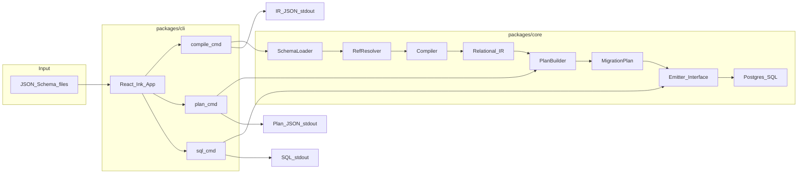

# Schemabase Phase 1 Architecture

## What is IR (Intermediate Representation)?

**IR = the canonical, DB-agnostic relational model** that Schemabase uses internally.

```
JSON Schema (input)  -->  Relational IR (canonical)  -->  SQL (output, per DB)
```

IR contains explicit relational concepts:

- **Table**: name, columns, primary key
- **Column**: name, type (mapped to DB types later), nullable, default
- **ForeignKey**: source table/column -> target table/column, on delete/update
- **Index**: table, columns, unique flag
- **Enum**: name, values
- **Provenance**: which JSON Schema file + JSON Pointer produced each IR node (for diagnostics, AI tooling)

**Why IR is the right choice for scale:**

- Multi-DB: Postgres/MySQL/SQLite become **emitters** from the same IR (no rewrite of inference)
- ETL: map source -> IR -> sink
- AI: generate IR reliably (less ambiguous than raw JSON Schema)
- Migrations: diff two IRs to produce alter statements

## Phase 1 Scope (emit-only, no DB connection)

Phase 1 focuses on **correct inference + stable contracts**. No DB connection yet.

**CLI commands:**

- `schemabase compile <schema.json>` -> IR JSON to stdout
- `schemabase plan <schema.json>` -> migration plan JSON (DB-agnostic ops)
- `schemabase sql <schema.json> --db postgres` -> Postgres SQL to stdout

**Phase 2 (later):** `schemabase apply --db postgres --url ...` (transactional execution)

## Repo Hierarchy

```
schemabase/
├── .github/
│   └── workflows/
│       └── ci.yml                 # GitHub Actions: bun install, test, typecheck
├── packages/
│   ├── core/
│   │   ├── package.json
│   │   ├── tsconfig.json
│   │   ├── src/
│   │   │   ├── schema/            # JSON Schema types, loader, $ref resolver
│   │   │   │   ├── types.ts
│   │   │   │   ├── loader.ts
│   │   │   │   └── resolver.ts
│   │   │   ├── ir/                # Relational IR types + provenance
│   │   │   │   ├── types.ts
│   │   │   │   └── index.ts
│   │   │   ├── compile/           # JSON Schema -> IR compiler
│   │   │   │   ├── compile.ts
│   │   │   │   ├── naming.ts      # deterministic table/column naming
│   │   │   │   └── inference.ts   # relationship/index inference
│   │   │   ├── plan/              # IR -> MigrationPlan (DB-agnostic ops)
│   │   │   │   ├── types.ts
│   │   │   │   └── builder.ts
│   │   │   ├── emitters/          # Plan -> SQL per DB
│   │   │   │   ├── types.ts       # Emitter interface
│   │   │   │   └── postgres.ts    # Postgres SQL emitter
│   │   │   └── index.ts           # public API
│   │   └── test/
│   │       ├── compile.test.ts    # golden tests: schema -> IR
│   │       ├── plan.test.ts       # IR -> plan tests
│   │       ├── postgres.test.ts   # plan -> SQL tests
│   │       └── fixtures/          # test JSON Schemas + expected outputs
│   │           ├── simple-user.json
│   │           ├── simple-user.ir.json
│   │           ├── one-to-many.json
│   │           └── one-to-many.ir.json
│   └── cli/
│       ├── package.json
│       ├── tsconfig.json
│       ├── src/
│       │   ├── main.tsx           # Ink app entry
│       │   ├── commands/
│       │   │   ├── compile.tsx
│       │   │   ├── plan.tsx
│       │   │   └── sql.tsx
│       │   └── ui/                # Ink components (later: progress, diff)
│       │       └── Output.tsx
│       └── test/
│           └── cli.test.ts        # e2e: run commands, check stdout
├── package.json                   # Bun workspace root
├── tsconfig.base.json             # shared TS config
├── bunfig.toml                    # Bun config
├── LICENSE
└── README.md
```

## Architecture Diagram



## CI Pipeline (GitHub Actions)

```yaml
# .github/workflows/ci.yml
name: CI
on: [push, pull_request]
jobs:
  test:
    runs-on: ubuntu-latest
    steps:
      - uses: actions/checkout@v4
      - uses: oven-sh/setup-bun@v2
      - run: bun install
      - run: bun run typecheck
      - run: bun test
```

## Test Strategy

**Golden tests (packages/core/test/):**

- Input: JSON Schema fixture (e.g., `fixtures/simple-user.json`)
- Expected: IR JSON snapshot (e.g., `fixtures/simple-user.ir.json`)
- Test: compile input, compare to expected (deep equal or snapshot)

**Unit tests:**

- Naming: deterministic table/column name generation
- Inference: relationship detection (1:1, 1:N, N:M), index inference
- Emitter: plan ops -> correct SQL strings

**CLI e2e tests (packages/cli/test/):**

- Spawn CLI process, assert stdout contains expected IR/SQL
- Assert exit code 0 on success, non-zero on invalid input

## Key Files to Implement First

1. [`packages/core/src/ir/types.ts`](packages/core/src/ir/types.ts) - IR type definitions
2. [`packages/core/src/schema/loader.ts`](packages/core/src/schema/loader.ts) - load + resolve JSON Schema
3. [`packages/core/src/compile/compile.ts`](packages/core/src/compile/compile.ts) - main compiler
4. [`packages/core/test/compile.test.ts`](packages/core/test/compile.test.ts) - golden tests
5. [`.github/workflows/ci.yml`](.github/workflows/ci.yml) - CI pipeline
6. [`packages/cli/src/main.tsx`](packages/cli/src/main.tsx) - CLI entry

## Example: Simple User Schema -> IR

**Input (`simple-user.json`):**

```json
{
  "$id": "User",
  "type": "object",
  "properties": {
    "id": { "type": "string", "format": "uuid" },
    "email": { "type": "string", "format": "email" },
    "name": { "type": "string" },
    "createdAt": { "type": "string", "format": "date-time" }
  },
  "required": ["id", "email"]
}
```

**Output (IR):**

```json
{
  "tables": [{
    "name": "users",
    "columns": [
      { "name": "id", "type": "uuid", "nullable": false, "primaryKey": true },
      { "name": "email", "type": "text", "nullable": false },
      { "name": "name", "type": "text", "nullable": true },
      { "name": "created_at", "type": "timestamptz", "nullable": true }
    ],
    "indexes": [],
    "provenance": { "file": "simple-user.json", "pointer": "/" }
  }],
  "foreignKeys": [],
  "enums": []
}
```

**Postgres SQL output:**

```sql
CREATE TABLE users (
  id UUID PRIMARY KEY,
  email TEXT NOT NULL,
  name TEXT,
  created_at TIMESTAMPTZ
);
```